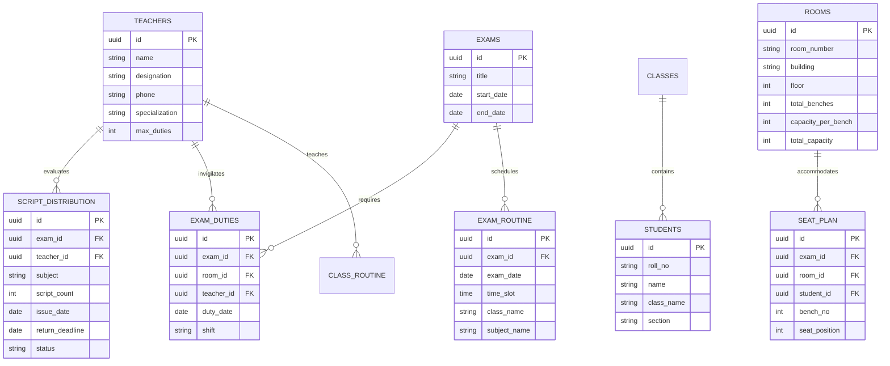

# 🏫 স্মার্ট ক্লাস রুটিন, সিট প্ল্যান ও এক্সাম ম্যানেজমেন্ট সিস্টেম
## (Smart Class Routine, Exam Routine, Duty Engine & Seat Planning Web Application)

---

## 📌 ১. প্রজেক্টের পরিচিতি ও উদ্দেশ্য (Project Overview)

এই ওয়েব অ্যাপ্লিকেশনটি শিক্ষা প্রতিষ্ঠানের (স্কুল, কলেজ, মাদরাসা) **দৈনন্দিন ক্লাস রুটিন, পরীক্ষার রুটিন, রুম ক্যাপাসিটি অ্যানালাইসিস, অটোমেটিক সিট প্ল্যানিং, শিক্ষকদের ডিউটি সমবন্টন এবং পরীক্ষার উত্তরপত্র (Paper) বন্টন ট্র্যাকিং** এর ঝামেলা সম্পূর্ণ নিরসন করার উদ্দেশ্যে ডিজাইন করা হয়েছে। 

এটি একটি সম্পূর্ণ **ডেডিকেটেড প্রসেসিং প্ল্যাটফর্ম**, যেখানে জটিল হিসাব-নিকাশ অ্যালগরিদম লাইভ ক্যালকুলেট করে এক ক্লিকে প্রিন্ট-রেডি রিপোর্ট জেনারেট করে দেবে।

---

## 🛠️ ২. প্রস্তাবিত টেকনোলজি স্ট্যাক (Technology Stack)

| লেয়ার | টেকনোলজি | ব্যবহারের কারণ |
| :--- | :--- | :--- |
| **Frontend** | React (Next.js 14 App Router) | দ্রুত রেন্ডারিং, Server Components, SEO ও রুটিন প্রিন্টিং অপটিমাইজেশন |
| **Styling & UI** | Vanilla CSS + Tailwind / Shadcn UI + Lucide Icons | প্রিমিয়াম ডার্ক/লাইট মোড, আধুনিক গ্লাসমেটালিক ডিজাইন ও ফ্লুইড এনিমেশন |
| **Backend** | Next.js API Routes / Server Actions | নিরাপদ ডাটা প্রসেসিং ও অ্যালগরিদম এক্সিকিউশন |
| **Database** | PostgreSQL (Supabase / Prisma ORM) | রিলেশনাল ডাটাবেজ (ক্লাস, রুম, সিট, রুটিন সম্পর্কিত ডাটা হ্যান্ডলিং) |
| **Export/Print** | React-To-Print, jsPDF, SheetJS (Excel) | এক ক্লিকে সিট প্ল্যান, রুটিন ও চালানPDF/Excel এক্সপোর্ট |

---

## 👥 ৩. ইউজার রোল ও পারমিশন (User Roles)

1. **Super Admin / Headmaster:** পূর্ণ নিয়ন্ত্রণ (সব ডাটা দেখা, রুটিন ও ডিউটি এডিটিং/কনফার্মেশন, লক করা)।
2. **Exam Controller / Routine Master:** রুটিন তৈরি, রুম ক্রিয়েট, সিট প্ল্যান রান করা, ডিউটি বন্টন ও পেপার বন্টন আপডেট।
3. **Teacher (শিক্ষককূল):** নিজের ক্লাস রুটিন দেখা, পরীক্ষার ডিউটি ডেট ও হল জানা, বরাদ্দকৃত পরীক্ষার খাতা ট্র্যাকিং।
4. **Student / Public Notice:** ক্লাস ও পরীক্ষার রুটিন এবং রোল নম্বর দিয়ে সিট প্ল্যান ও রুম নম্বর সার্চ করার পাবলিক ভিউ।

---

## 🚀 ৪. ফিচারসমূহের বিস্তারিত বিবরণ ও কার্যপ্রণালী (Detailed Feature Breakdown)

### 👨‍🏫 ফিচার ১: শিক্ষকদের নাম ও প্রোফাইল এন্ট্রি (Teacher Management)
* **ডাটা এন্ট্রি:**
  - শিক্ষকের নাম, আইডি, পদবী (যেমন: সিনিয়র শিক্ষক, সহকারী শিক্ষক)।
  - মোবাইল নাম্বার, ইমেইল।
  - সাবজেক্ট স্পেশালাইজেশন (কোন কোন বিষয়ে ক্লাস/পরীক্ষা নিতে পারেন)।
  - সর্বোচ্চ দৈনিক/সাপ্তাহিক ডিউটি সীমা (Duty Limits)।
  - টিচার ক্যাটাগরি (মহিলা শিক্ষক, সিনিয়র শিক্ষক - যাঁদের নির্দিষ্ট তলায় বা বিশেষ ডিউটি ছাড়ের প্রয়োজন হতে পারে)।
* **ড্যাশবোর্ড:**
  - শিক্ষকের সক্রিয় অবস্থা ও মোট এসাইনকৃত ক্লাস ও ডিউটির ওভারভিউ।

---

### 🎓 ফিচার ২: ছাত্র সংখ্যা ও নাম এন্ট্রি (Student Data Management)
* **দুই ধরণের এন্ট্রি মোড:**
  1. **কুইক মোট সংখ্যা এন্ট্রি (Quick Bulk Mode):** শুধু শ্রেণী (যেমন: Class 6, Sec A) এবং মোট ছাত্র সংখ্যা (যেমন: 45) বসিয়ে দ্রুত সিস্টেম চালু করা।
  2. **বিস্তারিত শিক্ষার্থী এন্ট্রি (Detailed Student Mode):** শিক্ষার্থীর নাম, রোল নম্বর, সেকশন, শিফট (সকাল/দিবা) এবং মোবাইল নাম্বার এন্ট্রি বা CSV/Excel ফাইল আপলোড।
* **ফিল্টারিং:** শ্রেণী, সেকশন ও রোল রেঞ্জ অনুযায়ী ডাটা ফিল্টারিং।

---

### 📅 ফিচার ৩: ডাইনামিক ক্লাস রুটিন মডিউল (Dynamic Class Routine Generator)
* **ইনপুট কাস্টমাইজেশন:**
  - পিরিয়ডের সংখ্যা (যেমন: ১ম পিরিয়ড থেকে ৮ম পিরিয়ড), বিরতি/টিফিন সময় সেটআপ।
  - সপ্তাহের কার্যদিবস (রবি - বৃহস্পতিবার)।
* **বিষয় ও শিক্ষক ম্যাপিং:**
  - কোন ক্লাসের কোন সেকশনে কোন টিচার কোন বিষয় কত পিরিয়ড পড়াবেন তা কনফিগার করা।
* **স্মার্ট ক্ল্যাশ ডিটেকশন (Auto Conflict Avoidance):**
  - একই টিচারকে একই পিরিয়ডে দুটি ভিন্ন ক্লাসে অ্যাসাইন করা রোধ করবে।
  - কোনো টিচারের পর পর টানা বেশি পিরিয়ড হলে ওয়ার্নিং দেবে।
* **প্রিন্ট ভিউ:**
  - **Class-wise Routine:** শ্রেণীভিত্তিক রুটিন।
  - **Teacher-wise Routine:** ব্যক্তিগত শিক্ষক রুটিন।
  - **Master Routine Table:** এক পেজে পুরো স্কুলের রুটিন গ্রিড।

---

### 📆 ফিচার ৪: পরীক্ষার রুটিন মডিউল (Exam Routine Builder)
* **পরীক্ষা তৈরি:** পরীক্ষার নাম (যেমন: অর্ধ-বার্ষিক পরীক্ষা ২০২৬), তারিখ সীমা, শিফট/টাইম স্লট।
* **বিষয়ভিত্তিক শিডিউলিং:** 
  - তারিখ অনুযায়ী বিভিন্ন শ্রেণীর বিষয় নির্বাচন।
  - বিষয়ভিত্তিক গ্যাপ দিন (Study Gap Days) অটোমেটিক হাইলাইট করা।
* **সংঘাত পরীক্ষা:** একই সময়ে একই ক্লাসের দুটি পরীক্ষা যেন না পড়ে তা নিশ্চিত করা।

---

### 🏠 ফিচার ৫: পরীক্ষা সেকশনের রুম ও ক্যাপাসিটি ফিলমেন্ট (Exam Hall & Capacity Fulfillment Engine)
* **রুম কনফিগারেশন:**
  - রুম নাম্বার/নাম (যেমন: Room 101, Science Lab 2), বিল্ডিং ও ফ্লোর নাম্বার।
  - রুমে মোট বেঞ্চের সংখ্যা, প্রতি বেঞ্চে কতজন শিক্ষার্থী বসবে (যেমন: ২ জন বা ৩ জন)।
  - রুমের মোট সিট ক্যাপাসিটি অটো ক্যালকুলেট (বেঞ্চ × প্রতি বেঞ্চের ক্যাপাসিটি)।
* **ডাইনামিক রুম ফুলফিলমেন্ট রুল (Multi-Class Room Allocation):**
  - **সমস্যা:** একটি রুমে শুধু একটি ক্লাসের ছাত্র বসালে নকলের সুযোগ থাকে।
  - **সমাধান:** কোন রুমে কোন কোন ক্লাসের কতজন ছাত্র বসবে তা রুল দিয়ে সেট করা বা সিস্টেমকে অটোমেটিক ক্যালিব্রেট করতে দেওয়া।
  - **উদাহরণ রুল:**
    - রুম ১০১ (ক্যাপাসিটি ৪০): ৮ম শ্রেণী (২০ জন) + ১০ম শ্রেণী (২০ জন) = ৪০ (রুম ফুলফিল)।
    - রুম ১০২ (ক্যাপাসিটি ৪৮): ৬ষ্ঠ শ্রেণী (২৪ জন) + ৯ ম শ্রেণী (২৪ জন) = ৪৮ (রুম ফুলফিল)।
  - রুম ক্যাপাসিটি ওভারফ্লো বা আন্ডারফ্লো হলে ভিজ্যুয়াল অ্যালার্ট (রেড/গ্রিন ইন্ডিকেটর)।

---

### 🪑 ফিচার ৬: স্মার্ট সিট প্ল্যান জেনারেটর (Smart Automated Seat Planner)
* **অটো জেনারেশন মেথড:**
  - **অল্টারনেট / জিকজ্যাক মেথড (Zig-Zag Seating):** এক বেঞ্চে ৮ম শ্রেণীর রোল ১ বসলে তার পাশে বসবে ১০ম শ্রেণীর রোল ১। পরবর্তী সারিতে ১ম সিটে ১০ম শ্রেণী, ২য় সিটে ৮ম শ্রেণী।
  - **রোল ক্রম বজায় রাখা:** রোল নাম্বার অনুযায়ী প্রতিটি রুমে নিখুঁতভাবে সিট সাজানো।
* **প্রিন্ট ফরম্যাট আউটপুট:**
  1. **Door Notice Card (দরজার নোটিশ):** পরীক্ষার নাম, রুম নম্বর, কোন রোল থেকে কোন রোল পর্যন্ত এই রুমে পরীক্ষা দেবে তার বোর্ড/ব্যানার প্রিন্ট।
  2. **Desk Sticker (ডেস্ক স্টিকার):** প্রতিটি সিটের কোণায় লাগানোর জন্য রোল, সেকশন ও বিষয় সম্বলিত অটো কিউআর/লেবেল স্টিকার।
  3. **Master Seat Plan Sheet:** নোটিশ বোর্ডে টাঙানোর জন্য পুরো স্কুলের সিট প্ল্যান টেবিল।

---

### 👮‍♂️ ফিচার ৭: শিক্ষকদের ডিউটি বণ্টন ও ডিউটি গণনা ইঞ্জিন (Teacher Duty Engine & Counter)
* **প্রয়োজনীয় ইনভিজিলেটর গণনা:**
  - রুমের আকার ও শিক্ষার্থীর সংখ্যা অনুযায়ী রুমপ্রতি ১ জন বা ২ জন গার্ড হিসাব করা।
* **সমতা অ্যালগরিদম (Equal Distribution Algorithm):**
  - সকল শিক্ষকের মোট পরীক্ষার দিন অনুযায়ী সমপরিমাণ ডিউটি ভাগ করে দেওয়া (যেমন: প্রত্যেকের ৫টি করে ডিউটি)।
  - সিনিয়র শিক্ষক বা বিশেষ ছাড়প্রাপ্তদের ডিউটি কাউন্ট নির্দিষ্ট সীমার মধ্যে রাখা।
* **ডিউটি সোয়াপ ও বিকল্প নাইট/ডে অ্যাডজাস্টমেন্ট:**
  - কোনো শিক্ষক অসুস্থ বা অনুপস্থিত থাকলে ডিউটি এক্সচেঞ্জ/সোয়াপ (Swap) করার সুবিধা।
* **রিপোর্ট ও কাউন্টার:**
  - টিচার-ওয়াইজ ডিউটি লিস্ট (কে কোন তারিখে কোন রুমে ডিউটিতে থাকবেন)।
  - সামারি টেবিল: কার মোট কয়টি ডিউটি সম্পন্ন হয়েছে এবং কয়টি বাকি আছে।

---

### 📦 ফিচার ৮: পেপার ডিস্ট্রিবিউশন ও উত্তরপত্র ট্র্যাকিং (Paper Distribution & Script Tracking)
* **পরীক্ষার আগের ধাপ (Question & Answer Sheet Delivery to Hall):**
  - পরীক্ষা শুরু হওয়ার ১৫ মিনিট আগে রুম অনুযায়ী কতটি প্রশ্নপত্র এবং কতটি মেইন উত্তরপত্র/ওএমআর প্রয়োজন তা অটোমেটিক চালান (Challan) জেনারেট।
  - হল গার্ড শিক্ষক চালানে স্বাক্ষর করে খাতা ও প্রশ্ন গ্রহণ করবেন।
* **পরীক্ষা পরের ধাপ (Collected Script Distribution to Examiners):**
  - পরীক্ষা শেষে জমা হওয়া উত্তরপত্র (Answer Scripts) বান্ডেল আকারে বিষয়ভিত্তিক শিক্ষকদের মূল্যায়ন (খাতা দেখা)-এর জন্য প্রদান করা।
  - কোন শিক্ষক কোন বিষয়ের কতটি খাতা গ্রহণ করলেন, গ্রহণের তারিখ এবং জমা দেওয়ার শেষ তারিখ ডিজিটাল ট্র্যাকিং।
  - খাতা জমার সময়সীমা পার হলে স্বয়ংক্রিয় নোটিফিকেশন/রিমাইন্ডার প্রদর্শন।

---

## 📐 ৫. ডাটাবেজ স্কিমা ডিজাইন (Database Schema Blueprint)



---

## 🎨 ৬. ইউজার ইন্টারফেস ও ডিজাইন গাইডলাইন (UI/UX Design Concept)

1. **ড্যাশবোর্ড ওভারভিউ (Executive Dashboard):**
   - আধুনিক কার্ড লেআউট সহ আজকের পরীক্ষা, কোন রুমে কতজন ছাত্র, আজ কার কার ডিউটি আছে এবং কয়টি খাতা শিক্ষকগণ জমা দিয়েছেন তার লাইভ কাউন্টার।
2. **ইন্টারেক্টিভ সিট প্ল্যান বিল্ডার:**
   - ড্র্যাগ অ্যান্ড ড্রপ (Drag & Drop) অথবা ড্রপডাউন দিয়ে রুম সিলেক্ট করে সাথে সাথে সিট লেআউট প্রিভিউ দেখা।
3. **প্রিন্ট-অপটিমাইজড মোড (Print-Ready CSS):**
   - স্ক্রিনে যেমনই দেখাক না কেন, প্রিন্ট বাটনে চাপ দিলে হেডার, ফুটার্স ও অনাকাঙ্ক্ষিত সাইডবার মুছে গিয়ে শুধু ঝকঝকে এ৪ সাইজ প্রাতিষ্ঠানিক ফরম্যাটে প্রিন্ট হবে।

---

## ⚙️ ৭. সিট প্ল্যান ও ডিউটি অ্যালগরিদমের লজিক (Core Algorithms)

### 🌀 অ্যালগরিদম ১: অল্টারনেট সিট অ্যালগরিদম (Alternate Seat Distribution Logic)
```typescript
// কাল্পনিক অ্যালগরিদম লজিক
function generateSeatPlan(room, classA_Students, classB_Students) {
  let benchIndex = 1;
  let seats = [];
  
  while (classA_Students.length > 0 || classB_Students.length > 0) {
    // সিট ১ (বাম পাশে): ক্লাস A এর ছাত্র
    if (classA_Students.length > 0) {
      seats.push({ bench: benchIndex, position: 'Left', student: classA_Students.shift() });
    }
    // সিট ২ (ডান পাশে): ক্লাস B এর ছাত্র
    if (classB_Students.length > 0) {
      seats.push({ bench: benchIndex, position: 'Right', student: classB_Students.shift() });
    }
    benchIndex++;
    if (benchIndex > room.total_benches) break; // রুম ফুল
  }
  return seats;
}
```

### ⚖️ অ্যালগরিদম ২: শিক্ষক ডিউটি সমবন্টন লজিক (Fair Duty Allocation Engine)
1. সকল শিক্ষকের তালিকা নিন এবং ডিউটি কাউন্ট = 0 সেট করুন।
2. তারিখ অনুযায়ী প্রতি পরীক্ষার রুমের জন্য কতজন ইনভিজিলেটর লাগবে তার তালিকা তৈরি করুন।
3. যে শিক্ষকের ডিউটি সংখ্যা সবচেয়ে কম এবং উক্ত তারিখে যাঁর নিজের বিষয়ের পরীক্ষা নেই বা যিনি ফ্রি আছেন, তাঁকে অ্যালট করুন।
4. সর্বশেষে ডিউটি কাউন্ট আপডেট করুন।

---

## 📑 ৮. রিপোর্ট ও প্রিন্ট আউটপুট সামারি (Reports & Exports)

1. **রুমভিত্তিক সিট প্ল্যান শিট (Door Sheet)**
2. **শিক্ষার্থী সিট স্লিপ / স্টিকার (Desk Slip)**
3. **শিক্ষকদের ডিউটি রোস্টার (Teacher Duty Roster)**
4. **প্রশ্ন ও খাতা ডেলিভারি চালানের কপি (Exam Hall Delivery Challan)**
5. **খাতা বন্টন রেজিস্টার (Script Distribution Tracker)**
6. **মাস্টার ক্লাস ও এক্সাম রুটিন (Master Routines)**

---

> 💡 **নোট:** এই সিস্টেম ফাইলটির প্রস্তাবনা অনুযায়ী আমরা একটি স্বতন্ত্র Next.js বা React প্ল্যাটফর্ম ডেভেলপ করতে পারি।
